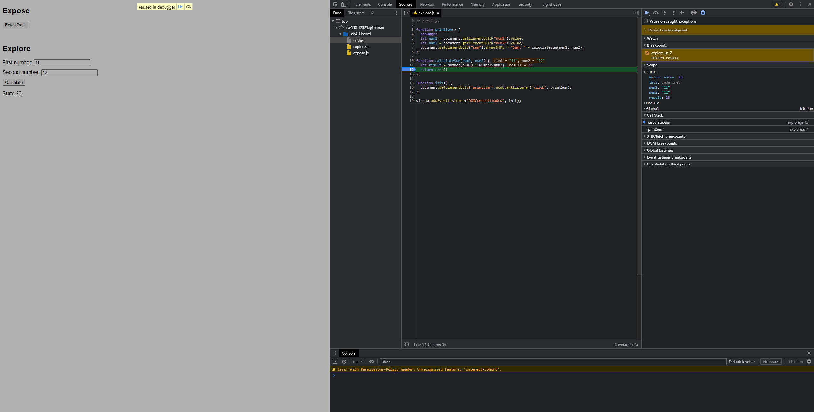

1. the bug is that the function returns the result of string addition of first and second number instead of numeric addiction. eg.(11 + 12 suppose to return 23 instead the function return 1112)
2. I fix the bug by performing a numeric conversion in the expression

